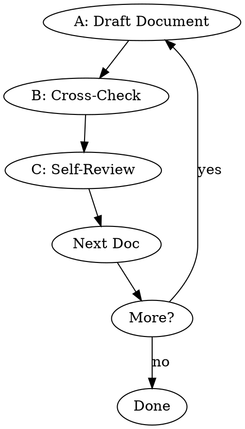

# Pre-Development Documentation

This skill supplements the earlier propose/design phase. It generates technical specification documents — API (Swagger) and Database — that are not covered by proposal, design, tasks, or specs.

Generate pre-dev docs iteratively: API → Database (not all required every project).

## Language Adaptation

Query the plugin's required output language using the following script:

```bash
python ${CLAUDE_PLUGIN_ROOT}/scripts/config.py {current_project_path} language
```

Use the language returned by the script as the default language for all user-facing responses and outputs in this skill. If the script returns no output or fails, fall back to Chinese.

## Workflow

1. **Understand** - Derive vision, features, constraints from existing openspec docs.
2. **Classify** - Determine project type from available info, select docs from table below.
3. **Check Existing** - Carefully read and analyze ALL openspec artifacts under `openspec/changes/<name>/`, including proposal, design, tasks, and specs. **All four artifacts (proposal, design, tasks, specs) must exist.** If any are missing, consider the previous phases incomplete — STOP executing this skill and remind the user to run `openpowers-propose` first.

## Document Generation Loop



**CRITICAL: Complete A→B→C for EACH document, then move directly to the next. No skipping. No waiting for user review — proceed to next document immediately after self-review.**

### A: Draft Document

Read template from `${CLAUDE_PLUGIN_ROOT}/skills/openpowers-schema/references/template-{doc}.md`, create draft.

**IMPORTANT — If generating a database doc**: Before drafting, you MUST explore the project for existing database information — table names, fields, relationships, migrations, ORM models, etc. Do not create the database doc without this exploration.

### B: Cross-Check

Compare with existing docs in `openspec/changes/<name>/`. Record any conflicts found and self-correct when generating the document.

### C: Self-Review

**Step 1: Read and scan the document you just generated. Check each item:**

| Check        | What to scan for                                      |
| ------------ | ----------------------------------------------------- |
| Placeholders | Search for "TBD", "TODO", "[", incomplete sections    |
| Consistency  | Read through — do any sections contradict each other? |
| Scope        | Is this focused enough, or trying to do too much?     |
| Ambiguity    | Could any requirement be interpreted two ways?        |

**Step 2: Fix any issues found. Edit the document inline.**

**Step 3: Output this table to confirm you completed the review:**

```
## 📋 Self-Review: {Doc Name}

| Check | Status | Notes |
|-------|--------|-------|
| Placeholders | ✅/⚠️ | [what you found] |
| Consistency | ✅/⚠️ | [what you found] |
| Scope | ✅/⚠️ | [what you found] |
| Ambiguity | ✅/⚠️ | [what you found] |

[If ⚠️: What you fixed]
```

**The table is proof of review, not the review itself. You must actually scan the document first.**

### D: Continue to Next Doc

Do not wait for user review. After self-review is complete, immediately proceed to the next document (if any) or enter the completion phase.

## Doc Selection by Project Type

| Type                      | API | DB  |
| ------------------------- | --- | --- |
| Web/Full-Stack/API/Mobile | ✓   | ✓   |
| CLI                       | ✓   | ✗   |
| Desktop                   | opt | opt |

The above is a starting guide. The final decision on whether to generate API and Database docs must also be based on the design docs and specs in `openspec/changes/<name>/`.

## Red Flags — STOP

- **⚠️ No Self-Review table** → CRITICAL violation. Output table NOW.

## Rationalizations

| Excuse                    | Reality                                        |
| ------------------------- | ---------------------------------------------- |
| "I did review internally" | Internal ≠ visible. Output the table.          |
| "It's straightforward"    | Simple docs still have issues. Check anyway.   |

## Templates

| Document | Template                          | Key Content                       |
| -------- | --------------------------------- | --------------------------------- |
| API      | `${CLAUDE_PLUGIN_ROOT}/skills/openpowers-schema/references/template-api.md`      | Swagger 2.0 YAML specification    |
| Database | `${CLAUDE_PLUGIN_ROOT}/skills/openpowers-schema/references/template-database.md` | Schema, relationships, migrations |

## Output

- `openspec/changes/<name>/api.yaml`
- `openspec/changes/<name>/database.md`

## Completion

After all documents are generated, prompt the user: "You can run skill `openpowers-plan` to generate the implementation plan."
