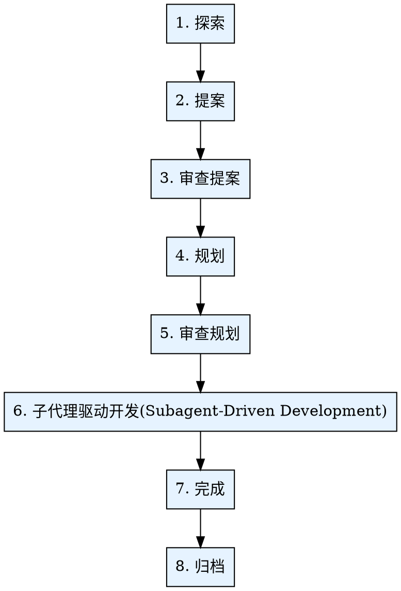

# OpenPowers 工作流

通过结构化流程将初始想法转化为完整实现、经过测试的功能：探索(Explore) → 提案(Propose) → 审查提案(Review Propose) → 规划(Plan) → 审查规划(Review Plan) → 子代理驱动开发(Subagent-Driven Development) → 完成(finalize) → 归档(Archive)。

<HARD-GATE>
禁止跳过任何阶段。每个阶段都建立在前一个阶段的基础上。跳过探索会导致需求理解不清。跳过提案会导致设计不充分。跳过规划会导致实现混乱。
</HARD-GATE>

## 强制从头开始

**强制从头开始**：当且仅当用户提供参数 - `FORCE_RESTART` 才开启`强制从头开始`参数。

## 语言适应

你应该通过以下脚本查询插件要求的`输出语言`：

```bash
python ${CLAUDE_PLUGIN_ROOT}/scripts/config.py {当前项目路径} language
```

将脚本返回的语言作为次命令所有面向用户的回答和输出的默认语言。如果脚本无输出或执行失败，回退使用中文。

## 阶段执行规则

1. **顺序执行：** 严格按照顺序执行各阶段：探索 → 提案 → 审查提案 → 规划 → 审查规划 → 子代理驱动开发 → 完成 → 归档。禁止跳过或乱序执行。

2. **自动转换：** 每个阶段完成后不要停下来等用户确认，直接自动开始下一个阶段。不要输出类似"阶段完成，是否继续？"这样的提示。

## 工作流概览



## 依赖检查

**开始工作流之前，验证 openspec 是否已安装：**

### 检查 openspec 安装

```bash
openspec --version
```

**如果 openspec 未安装：**

```bash
npm install -g @fission-ai/openspec@latest
```

**安装成功后：**

提醒用户："openspec 安装成功。请关闭 CLI 窗口并重新打开以继续。"

## 阶段检测 - 从当前状态恢复

**关键：如果已存在变更，不要从阶段 1 开始。**

**关键：当`强制从头开始`被打开后，绝对必须从阶段 1 开始。**

- 当`强制从头开始`被打开后，从阶段 1 开始
- 否则，通过 `openspec list --json` 或 `ls openspec/changes/` 检查活跃变更，再用以下产物映射确定阶段：

| 存在的产物 | 当前阶段 | 恢复操作 |
|-------------------|---------------|---------------|
| 无变更目录 | 阶段 1: 探索 | 开始探索 |
| `exploration.md` 存在（无 `.openspec.yaml`） | 阶段 1: 探索完成 | 开始阶段 2: 提案 |
| 仅有 `.openspec.yaml` | 阶段 2: 提案已开始 | 继续提案 |
| `.openspec.yaml`(not required) + `proposal.md` 仅此 | 阶段 2: 提案部分完成 | 继续设计/任务 |
| `.openspec.yaml`(not required) + `proposal.md` + `design.md` + `tasks.md` + `specs/` | 阶段 2: 提案完成 | 开始阶段 3: 审查提案 |
| `plan.json` 存在，尚无功能完成 | 阶段 4: 规划完成 | 开始阶段 5: 审查规划 |
| `plan.json`: 部分功能已完成/进行中，部分待完成 | 阶段 6: 开发进行中 | 恢复下一个功能 |
| 所有功能已完成 | 阶段 6: 开发完成 | 开始阶段 7: 完成 |
| 工作已集成（合并/PR） | 阶段 7: 完成 | 开始阶段 8: 归档 |
| 在归档目录中 | 阶段 8: 归档完成 | 工作流结束 |

多条活跃变更时，询问用户选择要恢复哪一个。

**到此，最后的openspec变更目录：`openspec/changes/<name>/` 必须在后续阶段之前确定**。
**RED LAW：每个阶段完成后不要停下来等用户确认，直接自动开始下一个阶段。不要输出类似"阶段完成，是否继续？"这样的提示。**

## 阶段 1: 探索(Explore)

### 目的
深入挖掘想法，理解上下文，调查代码库，澄清需求。

### 执行步骤
这一阶段，你必须严格准确按照如下步骤执行：

#### 1. 前置执行

- 生成当前阶段uuid
- 打印出这个uuid

#### 2. 阶段执行

调用 Skill: openpowers-explore 探索代码库，参数：
  - 探索类型：project
  - 探索内容：$ARGUMENTS
  - 输出文件路径：`openspec/changes/<name>/exploration.md`

#### 3. 后置执行

- 无

### 输出
`openspec/changes/<name>/exploration.md`

### 原则
探索时间，不是实现时间。不编写代码。

### 转换
当洞察探索清晰化后，提示用户接下来将自动进入提案。

## 阶段 2: 提案(Propose)

### 目的
创建包含所有产物的正式变更提案。

### 执行步骤
这一阶段，你必须严格准确按照如下步骤执行：

#### 1. 前置执行

- 无

#### 2. 阶段执行

1. 调用 Skill: openpowers-brainstorm 进行头脑风暴，理解并对齐用户需求。头脑风暴完成后自动进入下一步 — 禁止询问用户确认（例如禁止问"是否进入正式提案？"之类的问题）。
2. 调用 Skill: openpowers-propose 创建新变更提案

#### 3. 后置执行

- 无

### 输出
`openspec/changes/<name>/` 包含 `.openspec.yaml`、`proposal.md`、`design.md`、`tasks.md`、`specs/`

### 原则
所有产物一步生成。

### 转换
"所有产物已创建！自动进入提案审查。"

## 阶段 3: 审查提案(Review Propose)

### 目的
审查提案产物的完整性、一致性和可行性。

### 执行步骤
这一阶段，你必须严格准确按照如下步骤执行：

#### 1. 前置执行

- 无

#### 2. 阶段执行

调用 Skill: openpowers-review 审查提案，参数：
  - 审查类型：propose
  - 变更目录：`openspec/changes/<name>/`

#### 3. 后置执行

- 无

### 输出
审查通过（或修改建议）。

### 原则
提案质量决定实现质量，不放过设计缺陷。

### 转换
"提案审查通过。自动进入规划。"

## 阶段 4: 规划(Plan)

### 目的
将实现任务分解为独立、可追踪的功能及其依赖关系，以JSON的格式管理执行计划。

### 执行步骤
这一阶段，你必须严格准确按照如下步骤执行 （注意！在第二步你必须调用子代理，禁止直接调用技能openpowers-schema）：

#### 1. 前置执行

- 无

#### 2. 阶段执行

在本阶段，你必须按照如下 Task 模板，派发`规划阶段子代理`：

```
Task tool (general-purpose):
  description: "创建变更规划：[变更名称]"
  prompt: |
    你正在创建变更规划：[变更名称]

    ## 输出语言
    [`输出语言`]

    ## openspec 变更
    [`openspec/changes/<name>/`]

    ## 项目路径
    [当前项目路径]

    ## 工作步骤
    **必须遵守的红线规则**：一定要按顺序依次准确执行如下步骤，不可以跳过或者忽略任意一个skill，这是绝对无法容忍的！

    1. 调用 Skill: openpowers-schema 生成补充的预开发文档
    2. 调用 Skill: openpowers-plan 创建变更规划

    ## 执行检查清单
    - [] Skill: openpowers-schema 执行完成
    - [] Skill: openpowers-plan 执行完成
```

#### 3. 后置执行

- 无

### 输出
- `openspec/changes/<name>/plan.json`，包含功能 ID、描述、验收标准、文件路径、依赖关系和状态跟踪
- `openspec/changes/<name>/api.yaml`(可选)
- `openspec/changes/<name>/database.md`(可选)

### 原则
功能可在单个会话中完成，同时交付有意义的价值。

### 转换
"规划完成。自动进入规划审查。"

## 阶段 5: 审查规划(Review Plan)

### 目的
审查开发计划的可行性、功能拆分和依赖关系的正确性。

### 执行步骤
这一阶段，你必须严格准确按照如下步骤执行：

#### 1. 前置执行

- 无

#### 2. 阶段执行

调用 Skill: openpowers-review 审查计划，参数：
  - 审查类型：plan
  - 变更目录：`openspec/changes/<name>/`

#### 3. 后置执行

- 无

### 输出
审查通过（或修改建议）。

### 原则
计划质量决定开发效率，不放过不合理的拆分和依赖。

### 转换
"规划审查通过。自动进入子代理驱动开发。"

## 阶段 6: 子代理驱动开发(Subagent-Driven Development)

### 目的
每个功能使用全新子代理执行，配合 TDD 和两阶段审查。

### 执行步骤
这一阶段，你必须严格准确按照如下步骤执行：

#### 1. 前置执行

- 无

#### 2. 阶段执行

调用 Skill: openpowers-sdd 进行子代理驱动开发阶段执行，该技能中完全按照拓扑顺序处理功能。每个功能：派发实现者 → 实现者必须使用 `openpowers-tdd` → 规格合规审查 → 代码质量审查 → 标记功能完成。

#### 3. 后置执行

- 无

### 输出
所有功能已实现、已测试、已审查（功能级）。

### 原则
每个功能全新子代理 + TDD + 两阶段审查 = 高质量。

### 转换
"所有功能完成。自动进入完成操作。"

## 阶段 7: 完成(finalize)

### 目的
完成开发工作 — 合并、提 PR 或清理。

### 执行步骤
这一阶段，你必须严格准确按照如下步骤执行：

#### 1. 前置执行

- 无

#### 2. 阶段执行

按照如下 Task 模板，派发`完成阶段子代理`：

```
Task tool (general-purpose):
  description: "结束变更：[变更名称]"
  prompt: |
    你正在结束变更：[变更名称]

    ## 输出语言
    [`输出语言`]

    ## 项目路径
    [当前项目路径]

    ## 工作步骤
    1. 调用 Skill: openpowers-finalize 结束变更
```

#### 3. 后置执行

- 无

### 输出
工作已集成或已保留（通过 git 操作追踪）。

### 原则
任何集成前测试必须通过。

### 转换
"工作完成！自动进入归档。"

## 阶段 8: 归档(Archive)

### 目的
归档已完成的变更，同步规格到主规格，完成工作流。

### 执行步骤
这一阶段，你必须严格准确按照如下步骤执行：

#### 1. 前置执行

- 无

#### 2. 阶段执行

按照如下 Task 模板，派发`归档阶段子代理`：

```
Task tool (general-purpose):
  description: "归档变更：[变更名称]"
  prompt: |
    你正在归档变更：[变更名称]

    ## 输出语言
    [`输出语言`]

    ## openspec 变更目录
    [`openspec/changes/<name>/`]

    ## 项目路径
    [当前项目路径]

    ## 工作步骤
    1. 调用 Skill: openpowers-archive 归档变更
```

#### 3. 后置执行

- 无

### 输出
`openspec/changes/archive/YYYY-MM-DD-<name>/`，保留所有产物。

### 原则
归档保留完整的变更历史。

### 转换
"归档完成！工作流结束。"

## 核心原则

1. **先检测再开始** - 从阶段 1 开始之前检查是否存在已有变更。
2. **从当前阶段恢复** - 确定阶段并从该处恢复。
3. **顺序阶段** - 阶段序列内不可跳过。各阶段完成后不要停下来等用户确认，直接自动开始下一个阶段。
4. **先思考再编码** - 在实现之前进行探索、提案、文档、规划。
5. **所有功能使用 TDD** - 先测试，观察失败，最小化代码，重构。
6. **每个功能使用全新子代理** - 隔离上下文，专注执行。
7. **两阶段审查** - 先规格合规，再代码质量。两者都必须通过。
8. **测试必须通过** - 在审查、合并、集成之前。
9. **自动转换** - 阶段完成后不要停下来等用户确认，直接自动开始下一个阶段。不要输出类似"阶段完成，是否继续？"这样的提示。
10. **归档完成工作流** - 保留历史，同步规格。
11. **当`强制从头开始`被打开后，绝对必须从阶段 1 开始。并且！必须参考已有的设计、计划、规格等文档，在这个基础上更全面专业的重新设计！**

## 红色警告 - 停止

**绝不可：**
- 跳过任何阶段
- 存在活跃变更时从阶段 1 开始
- 在探索阶段编写代码
- 没有规划就开始实现
- 对任何功能跳过 TDD
- 在测试失败的情况下继续
- 在代码质量审查前跳过规格合规审查
- 跳过审查
- 没有最终审查就合并
- 未经确认删除工作
- 跳过归档
- 阶段检测错误后继续
- 忽略子代理的 BLOCKED/NEEDS_CONTEXT 状态
- 在未解决阻塞的情况下强制使用同一模型重试
- 执行命令：`openspec init`

**如果你发现自己在合理化或跳过步骤：停止。回到正确的阶段。遵循工作流。**

## 最终规则

```
想法 → 探索 → 提案 → 审查提案 → 规划 → 审查规划 → 子代理驱动开发(TDD) → 完成 → 归档
```

每个阶段。每个功能。每一次。
