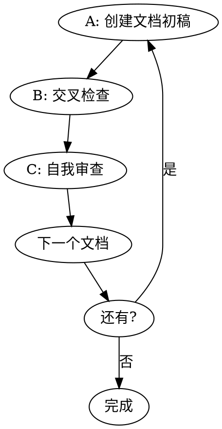

# 预开发文档

本技能是对前期 propose/design 阶段的补充文档生成。proposal、design、tasks、specs 未覆盖的 API（Swagger）和数据库技术规格文档，由本技能补充生成。

迭代生成预开发文档：API → 数据库（并非每个项目都需要全部生成）。

## 语言适应

通过以下脚本查询插件要求的输出语言：

```bash
python ${CLAUDE_PLUGIN_ROOT}/scripts/config.py {当前项目路径} language
```

将脚本返回的语言作为本次技能所有面向用户的回答和输出的默认语言。如果脚本无输出或执行失败，回退使用中文。

## 工作流

1. **理解** - 从已有 openspec 文档中理解愿景、功能、约束。
2. **分类** - 根据已有信息判断项目类型，从下表中选择文档。
3. **检查已有** - 仔细读取并分析理解 `openspec/changes/<name>/` 下面的所有 openspec artifacts，包括 proposal、design、tasks、specs。**这四类产物（proposal、design、tasks、specs）必须全部存在。** 如果任意缺失，则认为之前阶段未完成——停止执行本技能，并提醒用户先执行 `openpowers-propose` 技能。

## 文档生成循环



**关键：每个文档必须完整走完 A→B→C 循环，然后直接进入下一个文档。禁止跳过。无需等待用户审查——自我审查后立即继续生成下一个文档。**

### A: 创建文档初稿
从 `${CLAUDE_PLUGIN_ROOT}/skills/openpowers-schema/references/template-{doc}.md` 读取模板，创建文档初稿。

**重要——如果要创建数据库文档**：创建初稿前，必须先探索项目中已有的数据库相关信息——表名、字段、关系、迁移文件、ORM 模型等。未完成此探索检查前，禁止创建数据库文档。

### B: 交叉检查
与 `openspec/changes/<name>/` 中已有的文档对比。发现冲突则记录下来，在生成文档时自行修正。

### C: 自我审查

**第 1 步：阅读并扫描你刚生成的文档。逐项检查：**

| 检查项 | 扫描内容 |
|-------|------------------|
| 占位符 | 搜索 "TBD"、"TODO"、"["、不完整的章节 |
| 一致性 | 通读——是否有任何章节相互矛盾？ |
| 范围 | 是否足够聚焦，还是试图做太多？ |
| 歧义性 | 是否有任何需求可以被两种方式解读？ |

**第 2 步：修复发现的问题。直接在文档中编辑。**

**第 3 步：输出以下表格以确认你完成了审查：**

```
## 📋 自我审查：{文档名称}

| 检查项 | 状态 | 备注 |
|-------|--------|-------|
| 占位符 | ✅/⚠️ | [发现了什么] |
| 一致性 | ✅/⚠️ | [发现了什么] |
| 范围 | ✅/⚠️ | [发现了什么] |
| 歧义性 | ✅/⚠️ | [发现了什么] |

[如果有 ⚠️：你修复了什么]
```

**表格是审查的证明，而不是审查本身。你必须首先实际扫描文档。**

### D: 继续下一文档

无需等待用户审查。自我审查完成后，立即继续生成下一个文档（如有），或进入完成阶段。

## 按项目类型选择文档

| 类型 | API | 数据库 |
|------|-----|-----|
| Web/全栈/API/移动端 | ✓ | ✓ |
| CLI | ✓ | ✗ |
| 桌面端 | 可选 | 可选 |

以上为初步参考。最终是否需要生成 API 和数据库文档，还需根据 `openspec/changes/<name>/` 中的设计文档和 specs 判断。

## 红色警告 — 停止

- **⚠️ 无自我审查表格** → 严重违规。立即输出表格。

## 常见自欺借口

| 借口 | 真相 |
|--------|---------|
| "我内部审查过了" | 内部 ≠ 可见。输出表格。 |
| "这太简单了" | 简单的文档仍然会有问题。仍然要检查。 |

## 模板

| 文档 | 模板 | 关键内容 |
|----------|----------|-------------|
| API | `${CLAUDE_PLUGIN_ROOT}/skills/openpowers-schema/references/template-api.md` | Swagger 2.0 YAML 规范 |
| 数据库 | `${CLAUDE_PLUGIN_ROOT}/skills/openpowers-schema/references/template-database.md` | 模式、关系、迁移 |

## 输出

- `openspec/changes/<name>/api.yaml`
- `openspec/changes/<name>/database.md`

## 完成

所有文档生成后，并提示用户："可以运行技能 `openpowers-plan` 来生成实现计划。"
