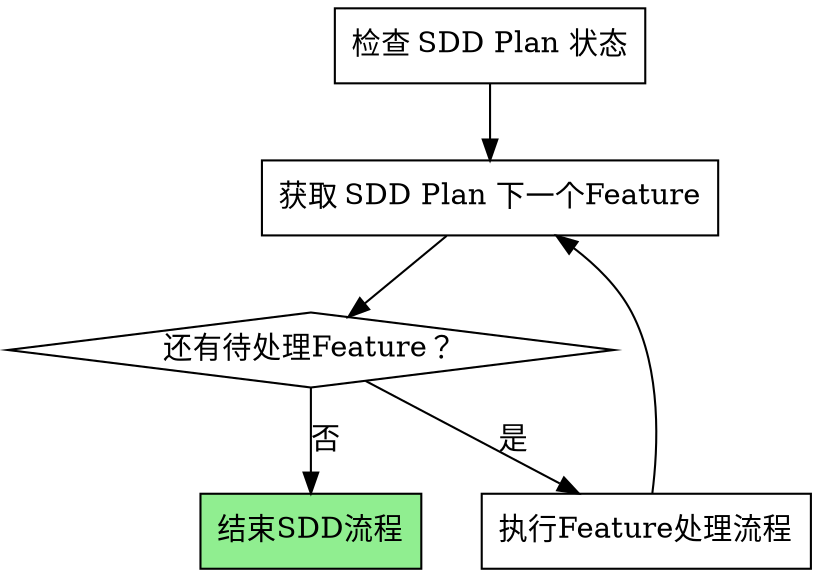
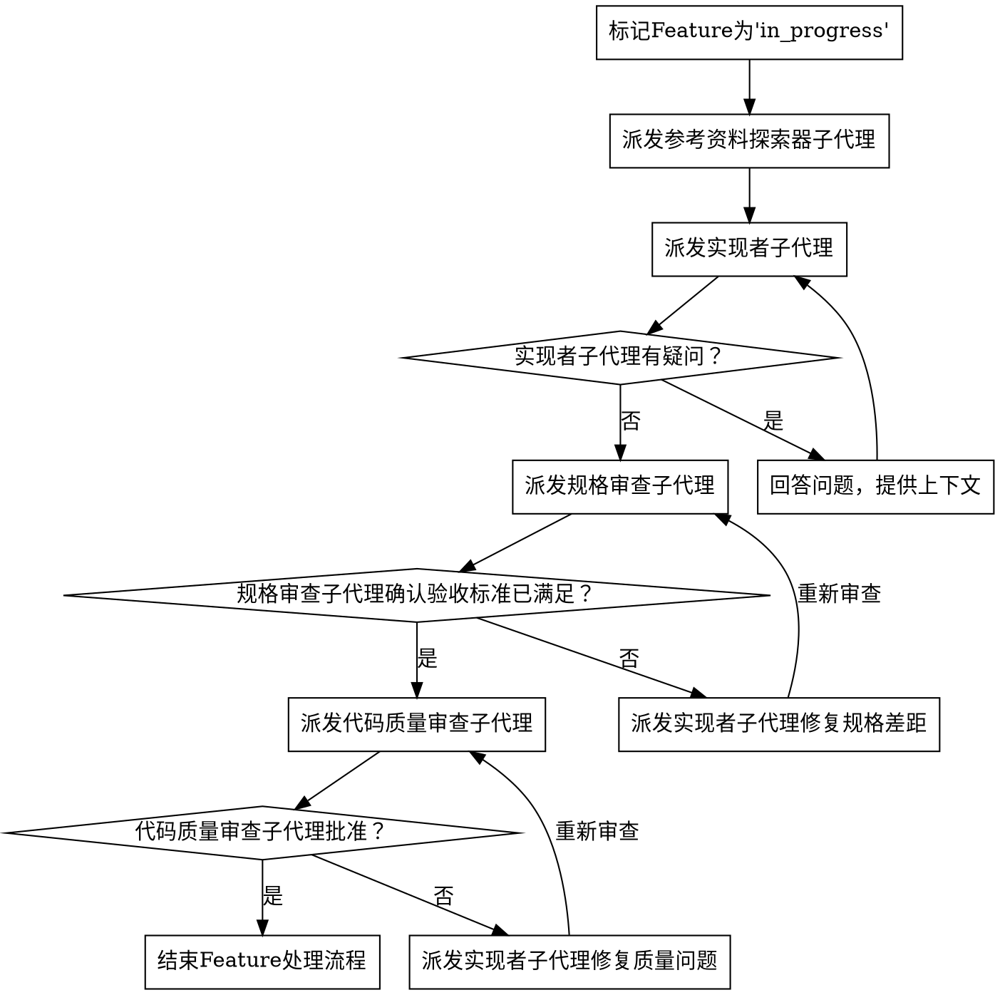

# 子代理驱动开发

通过为每个Feature派发全新的子代理来执行Feature列表，每个功能后进行两阶段审查：先规格合规审查，再代码质量审查。

**核心原则：** 每个功能全新子代理 + 两阶段审查（先规格后质量）= 高质量、快速迭代

**依赖顺序：** Feature数组中的Feature已按拓扑顺序预排序（依赖项在前，被依赖项在后）。按数组顺序处理。跳过任何依赖项尚未完成的功能——待其依赖项解决后再回来处理。

**前置任务：** 检查 `openspec/changes/<name>/plan.json` 是否存在，如果不存在，停止执行并提醒用户先执行技能 `openpowers-plan` 生成 `plan.json`

## 技能配置

通过以下脚本查询插件要求的`技能配置`：

```bash
python ${CLAUDE_PLUGIN_ROOT}/scripts/config.py {当前项目路径} language experimental.review.specs experimental.review.code
```

依次返回三个值：
  1. `language` — 输出语言。作为本次技能所有面向用户的回答和输出的语言，为 None 则默认使用中文
  2. `experimental.review.specs` — 派发规格审查子代理开关。该值不是 `True` 时，**不允许派发规格审查子代理**（这是用户的强制配置）
  3. `experimental.review.code` — 派发代码质量审查子代理开关。该值不是 `True` 时，**不允许派发代码质量审查子代理**（这是用户的强制配置）

## SDD流程



**你的SDD流程总体任务**：

1. 检查 SDD Plan 状态
2. 获取 SDD Plan 下一个Feature — 如果没有，调用 `openpowers-finalize` 结束SDD流程
3. 执行Feature处理流程：严格按照 `### 执行Feature处理流程` 的步骤准确执行
4. 从步骤 2 开始重复，直到没有更多待处理功能，然后调用 `openpowers-finalize` 结束SDD流程

### 检查 SDD Plan 状态

执行如下命令，检查 SDD Plan 当前状态：

```bash
python ${CLAUDE_PLUGIN_ROOT}/skills/openpowers-sdd/scripts/feature-manager.py status openspec/changes/\<name\>/plan.json
```

### 获取 SDD Plan 下一个Feature

执行如下命令，获取下一个要处理的SDD Plan的Feature：

```bash
python ${CLAUDE_PLUGIN_ROOT}/skills/openpowers-sdd/scripts/feature-manager.py next openspec/changes/\<name\>/plan.json
```

### 执行Feature处理流程



**你的Feature处理流程任务**：

1. 标记Feature为'in_progress'
2. 派发参考资料探索器子代理
3. 派发实现者子代理
4. 实现者子代理有疑问的话，回答问题后，重新派发实现者子代理
5. 派发规格审查子代理
6. 规格审查子代理验收不通过的话，重新派发实现者子代理修复规格差距
7. 派发代码质量审查子代理
8. 代码质量审查子代理验收不通过的话，重新派发实现者子代理修复代码质量问题
9. 结束Feature处理流程

**红线禁告**：在Feature处理工作流期间，禁止随意简化流程。以上列出的全部9项Feature处理流程任务必须按顺序逐一准确完整执行。

下面是Feature处理流程任务的详细执行步骤：

#### 标记Feature为'in_progress'

执行如下命令，将当前Feature标记为'in_progress'：

```bash
python ${CLAUDE_PLUGIN_ROOT}/skills/openpowers-sdd/scripts/feature-manager.py start openspec/changes/\<name\>/plan.json \<feature-id\>
```

#### 派发参考资料探索器子代理

严格按照模板：`${CLAUDE_PLUGIN_ROOT}/skills/openpowers-sdd/references/reference-explorer-prompt.md`，派发`参考资料探索器子代理`。

#### 派发实现者子代理

严格按照模板：`${CLAUDE_PLUGIN_ROOT}/skills/openpowers-sdd/references/code-implementer-prompt.md`，派发`实现者子代理`。

#### 派发规格审查子代理

- 前置条件：`experimental.review.specs = True`，否则**不允许派发规格审查子代理，跳过此审查**
- 严格按照模板：`${CLAUDE_PLUGIN_ROOT}/skills/openpowers-sdd/references/specs-reviewer-prompt.md`，派发`规格审查子代理`。

#### 派发代码质量审查子代理

- 前置条件：`experimental.review.code = True`，否则**不允许派发代码质量审查子代理，跳过此审查**
- 严格按照模板：`${CLAUDE_PLUGIN_ROOT}/skills/openpowers-sdd/references/quality-reviewer-prompt.md`，派发`代码质量审查子代理`。

#### 结束Feature处理流程
- 执行如下命令，将当前处理的Feature标记为'done'：
  ```bash
  python ${CLAUDE_PLUGIN_ROOT}/skills/openpowers-sdd/scripts/feature-manager.py complete openspec/changes/\<name\>/plan.json \<feature-id\>
  ```
- 在 tasks.md 中将Feature对应 task 标记为 [x]

## 功能管理

**使用 `${CLAUDE_PLUGIN_ROOT}/skills/openpowers-sdd/scripts/feature-manager.py` 代替 TodoWrite** 以进行持久化、跨会话跟踪。

**为什么：** TodoWrite 是会话范围的，跨会话丢失状态。功能列表 JSON 是持久化的，作为单一事实来源。

## 策略和优势

需要读取参考文档：`${CLAUDE_PLUGIN_ROOT}/skills/openpowers-sdd/references/important-matters.md` 获取到技能 openpowers-sdd 的策略和优势

## 示例工作流

你必须首先参考 `${CLAUDE_PLUGIN_ROOT}/skills/openpowers-sdd/references/example-workflow.md` 中的示例工作流，来进行本技能的执行。

## 允许读取的文档

**本技能 openpowers-sdd 仅允许读取以下文档，其他文档在本技能里面读取都是非法的**：

- `${CLAUDE_PLUGIN_ROOT}/skills/openpowers-sdd/references/example-workflow.md`
- `${CLAUDE_PLUGIN_ROOT}/skills/openpowers-sdd/references/important-matters.md`
- `${CLAUDE_PLUGIN_ROOT}/skills/openpowers-sdd/references/code-implementer-prompt.md`
- `${CLAUDE_PLUGIN_ROOT}/skills/openpowers-sdd/references/specs-reviewer-prompt.md`
- `${CLAUDE_PLUGIN_ROOT}/skills/openpowers-sdd/references/quality-reviewer-prompt.md`
- `${CLAUDE_PLUGIN_ROOT}/skills/openpowers-sdd/references/reference-explorer-prompt.md`

## 红色警告

**绝不可：**
- 读取本技能引用的模板和引用文件之外的项目文件（保持上下文清洁，实现工作由子代理完成）
- 在 main/master 分支上开始实现前，必须先询问用户是否同意，否则终止执行
- 跳过已启用的审查（规格合规或代码质量）— 配置开关为 `True` 时必须执行
- 跳过参考探索器的派发
- 在有未修复的问题时继续
- 并行派发多个实现子代理（会冲突）
- 让子代理读取功能列表 JSON 文件（应直接提供功能数据）
- 跳过场景设置上下文（子代理需要了解功能在整体中的位置）
- 忽略子代理的问题（在让其继续之前先回答）
- 在规格合规上接受"差不多就行"（规格审查员发现问题 = 未完成）
- 跳过审查循环（审查员发现问题 = 实现者修复 = 再次审查）
- 让实现者自我审查替代实际审查（两者都需要）
- **在规格合规未通过时开始代码质量审查**（顺序错误）
- 在任一审查仍有待解决问题时进入下一个功能
- 完成功能后忘记在 JSON 中更新功能状态
- **派发任何子代理为Backgrounded agent**（所有子代理必须在前台运行）

**如果子代理提问：**
- 清晰完整地回答
- 如果需要，提供额外的上下文
- 不要催促它们进入实现阶段

**如果审查员发现问题：**
- 派发新的实现者子代理修复它们
- 审查员再次审查
- 重复直到批准
- 不要跳过重新审查

**如果子代理功能失败：**
- 派发修复子代理并给出具体指令
- 不要尝试手动修复（会污染上下文）

## 集成关系

**必需的工作流技能：**
- **openpowers-plan** - 创建此技能执行的功能列表 JSON
- **openpowers-finalize** - 所有功能完成后完成开发

**子代理应使用：**
- **openpowers-tdd** - 子代理为每个功能遵循 TDD
