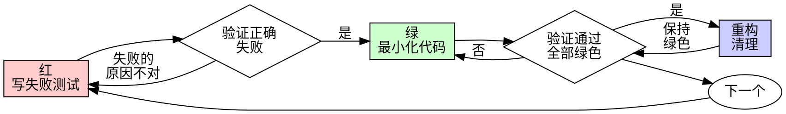

# 测试驱动开发（TDD）

## 概览

先写测试。看着它失败。写最小的代码使其通过。

**核心原则：** 如果你没有看到测试失败，你就不知道它是否测试了正确的东西。

**违反规则的文字就是违反规则的精神。**

## 何时使用

**始终要：**
- 新功能
- Bug 修复
- 重构
- 行为变更

**例外（询问你的人类搭档）：**
- 丢弃式原型
- 自动生成的代码
- 配置文件

在想"就这一次跳过 TDD"？停止。那是自欺。

## 铁律

```
没有先写失败测试，就没有生产代码
```

在测试之前写了代码？删掉。重新开始。

**没有例外：**
- 不要保留作为"参考"
- 不要在写测试时"适配"它
- 不要看它
- 删除意味着删除

从测试重新实现。没有商量。

## 红-绿-重构



### 红 - 写失败测试

写一个最小的测试来展示应该发生什么。

<Good>
```typescript
test('retries failed operations 3 times', async () => {
  let attempts = 0;
  const operation = () => {
    attempts++;
    if (attempts < 3) throw new Error('fail');
    return 'success';
  };

  const result = await retryOperation(operation);

  expect(result).toBe('success');
  expect(attempts).toBe(3);
});
```
清晰的名称，测试真实行为，只测一件事
</Good>

<Bad>
```typescript
test('retry works', async () => {
  const mock = jest.fn()
    .mockRejectedValueOnce(new Error())
    .mockRejectedValueOnce(new Error())
    .mockResolvedValueOnce('success');
  await retryOperation(mock);
  expect(mock).toHaveBeenCalledTimes(3);
});
```

模糊的名称，测试的是 mock 而非代码
</Bad>

**要求：**
- 一个行为
- 清晰的名称
- 真实代码（除非不可避免才用 mock）

### 验证红 - 看着它失败

**强制。绝不可跳过。**

```bash
npm test path/to/test.test.ts
```

确认：
- 测试失败（不是报错）
- 失败消息是预期的
- 失败是因为功能缺失（不是拼写错误）

**测试通过了？** 你在测试已有的行为。修复测试。

**测试报错了？** 修复错误，重新运行直到正确失败。

### 绿 - 最小化代码

写最简单的代码使测试通过。

<Good>
```typescript
async function retryOperation<T>(fn: () => Promise<T>): Promise<T> {
  for (let i = 0; i < 3; i++) {
    try {
      return await fn();
    } catch (e) {
      if (i === 2) throw e;
    }
  }
  throw new Error('unreachable');
}
```
刚好够通过
</Good>

<Bad>
```typescript
async function retryOperation<T>(
  fn: () => Promise<T>,
  options?: {
    maxRetries?: number;
    backoff?: 'linear' | 'exponential';
    onRetry?: (attempt: number) => void;
  }
): Promise<T> {
  // YAGNI
}
```
过度工程化
</Bad>

不要添加功能、重构其他代码，或超出测试范围地"改进"。

### 验证绿 - 看着它通过

**强制。**

```bash
npm test path/to/test.test.ts
```

确认：
- 测试通过
- 其他测试仍然通过
- 输出干净（无错误、无警告）

**测试失败？** 修改代码，不是测试。

**其他测试失败？** 立即修复。

### 重构 - 清理

仅在绿色之后：
- 移除重复
- 改进命名
- 提取辅助函数

保持测试绿色。不要添加行为。

### 重复

下一个功能的下一个失败测试。

## 好的测试

| 质量 | 好 | 坏 |
|---------|------|-----|
| **最小化** | 一件事。名称中有"and"？拆分它。 | `test('validates email and domain and whitespace')` |
| **清晰** | 名称描述行为 | `test('test1')` |
| **展示意图** | 展示期望的 API | 模糊了代码应该做什么 |

## 为什么顺序很重要

**"我之后会写测试来验证它工作"**

在代码之后写的测试会立即通过。立即通过什么都证明不了：
- 可能测试了错误的东西
- 可能测试了实现而非行为
- 可能漏掉了你忘记的边界情况
- 你从未看到它捕获到 bug

测试先行迫使你看到测试失败，证明它确实测试了某个东西。

**"我已经手动测试了所有边界情况"**

手动测试是临时的。你以为你测试了一切，但是：
- 没有你测试了什么的记录
- 代码变更时无法重新运行
- 在压力下容易忘记测试用例
- "我试的时候是好的" ≠ 全面的

自动化测试是系统化的。它们每次以相同方式运行。

**"删除 X 小时的工作是浪费"**

沉没成本谬误。时间已经过去了。你现在选择的是：
- 删除并用 TDD 重写（X 更多小时，高信心）
- 保留它并事后加测试（30 分钟，低信心，可能有 bug）

"浪费"是保留你不能信任的代码。没有真正测试的工作代码是技术债务。

**"TDD 是教条，务实意味着变通"**

TDD 就是务实的：
- 在提交前发现 bug（比事后调试更快）
- 防止回归（测试立即捕获破坏）
- 文档化行为（测试展示如何使用代码）
- 使重构成为可能（自由修改，测试捕获破坏）

"务实"的捷径 = 在生产环境调试 = 更慢。

**"测试后写能达到相同目标——关键在精神而非仪式"**

不。事后测试回答"这是做什么的？"先写测试回答"这应该做什么？"

事后测试被你的实现所偏见。你测试的是你构建的，而不是被要求的。你验证的是你记住的边界情况，而不是被发现的。

先写测试强制在实现之前发现边界情况。事后测试验证的是你记住了全部（你没有）。

30 分钟的事后测试 ≠ TDD。你得到了覆盖率，但丢失了测试有效的证明。

## 常见自欺借口

| 借口 | 真相 |
|--------|---------|
| "太简单不值得测试" | 简单代码也会出问题。测试只需 30 秒。 |
| "我之后再测试" | 立即通过的测试什么都证明不了。 |
| "测试后写能达到相同目标" | 事后测试 = "这做什么？" 先写测试 = "这应该做什么？" |
| "已经手动测试过了" | 临时 ≠ 系统化。没有记录，无法重新运行。 |
| "删除 X 小时是浪费" | 沉没成本谬误。保留未验证的代码是技术债务。 |
| "保留作为参考，先写测试" | 你会适配它。这就是事后测试。删除意味着删除。 |
| "需要先探索一下" | 没问题。丢弃探索，从 TDD 开始。 |
| "难测试 = 设计不清晰" | 倾听测试。难测试 = 难使用。 |
| "TDD 会拖慢我" | TDD 比调试更快。务实 = 测试先行。 |
| "手动测试更快" | 手动测试不证明边界情况。每次变更你都要重新测试。 |
| "现有代码没有测试" | 你正在改进它。为现有代码添加测试。 |

## 红色警告 - 停止并重新开始

- 测试之前写了代码
- 实现之后才测试
- 测试立即通过
- 无法解释测试为何失败
- 测试"稍后"添加
- 合理化"就这一次"
- "我已经手动测试过了"
- "测试后写能达到相同目的"
- "关键在于精神而非仪式"
- "保留作为参考"或"适配现有代码"
- "已经花了 X 小时，删除是浪费"
- "TDD 是教条的，我是务实的"
- "这次不同是因为……"

**以上所有都意味着：删除代码。从 TDD 重新开始。**

## 示例：Bug 修复

**Bug：** 接受了空邮箱

**红**

```typescript
test("rejects empty email", async () => {
  const result = await submitForm({ email: "" });
  expect(result.error).toBe("Email required");
});
```

**验证红**

```bash
$ npm test
FAIL: expected 'Email required', got undefined
```

**绿**

```typescript
function submitForm(data: FormData) {
  if (!data.email?.trim()) {
    return { error: "Email required" };
  }
  // ...
}
```

**验证绿**

```bash
$ npm test
PASS
```

**重构**
如需可提取多字段验证逻辑。

## 验证检查清单

在将工作标记为完成之前：

- [ ] 每个新函数/方法都有测试
- [ ] 在实现之前观察了每个测试失败
- [ ] 每个测试因预期原因失败（功能缺失，非拼写错误）
- [ ] 写了最小化代码使每个测试通过
- [ ] 所有测试通过
- [ ] 输出干净（无错误、无警告）
- [ ] 测试使用真实代码（mock 仅在不可避免时）
- [ ] 边界情况和错误已覆盖

无法勾选所有项？你跳过了 TDD。重新开始。

## 遇到困难时

| 问题 | 解决方案 |
|----------|----------|
| 不知道如何测试 | 先写期望的 API。先写断言。问你的人类搭档。 |
| 测试太复杂 | 设计太复杂。简化接口。 |
| 必须 mock 一切 | 代码耦合太高。使用依赖注入。 |
| 测试准备工作巨大 | 提取辅助函数。仍然复杂？简化设计。 |

## 调试集成

发现了 bug？写一个重现它的失败测试。遵循 TDD 循环。测试证明修复有效并防止回归。

绝不在没有测试的情况下修复 bug。

## 测试反模式

当添加 mock 或测试工具时，阅读 `references/testing-anti-patterns.md` 以避免常见陷阱：
- 测试 mock 行为而非真实行为
- 为生产类添加仅供测试用的方法
- 不理解依赖就 mock

## 最终规则

```
生产代码 → 存在测试并且测试先失败
否则 → 不是 TDD
```

没有人类搭档的许可不得有例外。

