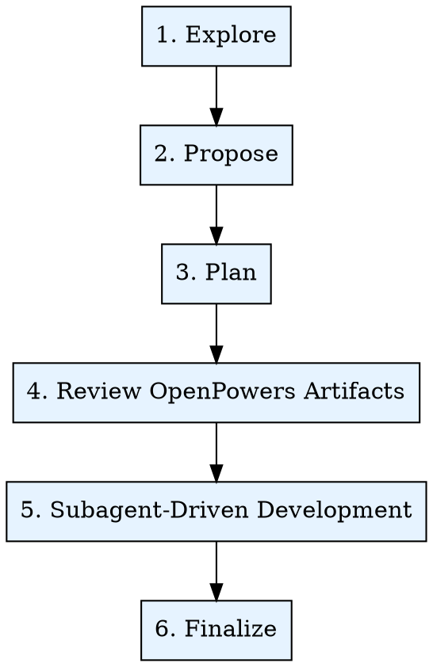

# OpenPowers Workflow

Transform initial ideas into fully implemented, tested features through a structured process: Explore → Propose → Plan → Review OpenPowers Artifacts → Subagent-Driven Development → Finalize.

<HARD-GATE>
Skipping any phase is forbidden. Each phase builds on the previous one. Skipping exploration leads to unclear requirements. Skipping proposal leads to inadequate design. Skipping planning leads to chaotic implementation.
</HARD-GATE>

## Force Restart

**Force Restart**: The `FORCE_RESTART` parameter is enabled only when the user provides the argument - `FORCE_RESTART`.

## Workflow Configuration

### Dependency Check

**Before starting the workflow, verify that openpowers is installed:**

```bash
openpowers --version
```

**If openpowers is not installed:**

```bash
npm install -g openpowers@latest
```

**After successful installation:**

Remind the user: "OpenPowers installed successfully. Please close the CLI window and reopen to continue."

### Language Adaptation

You SHOULD query the `output language` required by the plugin via the following script:

```bash
openpowers config show language
```

- `language`: **MUST** use the language as the default language for all user-facing responses and outputs. If the script returns no output or fails, fall back to Chinese.

## Phase Execution Rules

1. **Sequential Execution:** Execute phases strictly in order: Explore → Propose → Plan → Review OpenPowers Artifacts → Subagent-Driven Development → Finalize. Skipping or executing out of order is forbidden.

2. **Auto Transition:** After completing a phase, immediately start the next phase — do NOT pause and ask the user to confirm. Do not output prompts like "Phase complete, continue?"

## Workflow Overview



## Phase Detection - Resume from Current State

**Critical: Do not start from phase 1 if changes already exist.**

**Critical: When `Force Restart` is enabled, absolutely must start from phase 1.**

- When `Force Restart` is enabled, start from phase 1
- Otherwise, check active changes via `openpowers change list` or `ls openpowers/changes/`, then determine the phase using the artifact mapping below:

| Existing Artifacts | Current Phase | Resume Action |
|-------------------|---------------|---------------|
| No change directory or change directory is empty | Phase 1: Explore | Start exploration |
| `exploration.md` exists (no `proposal.md`) | Phase 1: Explore complete | Start Phase 2: Propose |
| `proposal.md` + `design.md` + `specs/` partially missing | Phase 2: Propose partially complete | Continue Phase 2: Propose |
| `proposal.md` + `design.md` + `specs/` complete | Phase 2: Propose complete | Start Phase 3: Plan |
| `plan.json` exists, no features completed yet | Phase 3: Plan complete | Start Phase 4: Review OpenPowers Artifacts |
| `plan.json`: some features completed/in_progress, some pending | Phase 5: Subagent-Driven Development in progress | Resume next feature |
| All features completed | Phase 5: Subagent-Driven Development complete | Start Phase 6: Finalize |
| Work integrated (merged/PR) and In archive directory | Phase 6: Finalize complete | Workflow ended |

When multiple active changes exist, ask the user to choose which one to resume.

**RED LAW: At this point, the final openpowers change directory: `openpowers/changes/<name>/` must be determined (or create one by yourself, do NOT ask user) before follow phases**. `<name>` MUST satisfy `KEBAB_CASE = /^[a-z][a-z0-9]*(-[a-z0-9]+)*$/`.

**RED LAW: After completing each phase, immediately start the next phase — do NOT pause and ask the user to confirm. Do not output prompts like "Phase complete, continue?"**.

## Phase 1: Explore

### Purpose
Deeply explore ideas, understand context, investigate the codebase, clarify requirements.

### Execution Steps
At this point, the final openpowers change directory: `openpowers/changes/<name>/` must be determined (or create one by yourself, do NOT ask user). In this phase, you must strictly and accurately follow these steps:

1. Invoke Skill: openpowers-explore to explore the project code, with parameters:
  - Exploration type: project
  - Exploration content: $ARGUMENTS
  - Output file path: `{cwd}/openpowers/changes/<name>/exploration.md`

### Output
`{cwd}/openpowers/changes/<name>/exploration.md`

### Principle
Exploration time, not implementation time. Do not write code.

### Transition
Exploration completed. Auto entering propose.

## Phase 2: Propose

### Purpose
Create a formal change proposal with all artifacts.

### Execution Steps
In this phase, you must strictly and accurately follow these steps (do NOT dispatch a subagent in this phase: propose and do NOT stop after completing brainstorm to ask user whether to proceed to propose --- just go straight into propose (openpowers-propose)):

#### 1. Pre-Execution

- You **MSUT** use mcp tool: `mcp__plugin_openpowers_openpowers-mcp-server__markBeginPropose` to make a beiginning mark.

#### 2. Phase Execution

1. Invoke Skill: openpowers-brainstorm to brainstorm and align on user requirements. And wait util this skill complete.
2. When executation of openpowers-brainstorm complete, then invoke Skill: openpowers-propose to create a new change proposal

#### 3. Post-Execution

1. After completing openpowers-brainstorm and openpowers-propose, you **MUST** use the AskUserQuestion tool to ask the user to choose a workflow mode from the following options:
   - Lite     (Extreme mode,  Code exploration ✅ | Propose & Plan ✅ | Artifacts review ❌ | Reference exploration ❌ | Feature Implement ✅ | Spec review ❌ | Code review ❌ | Final Integration ✅)
   - Standard (Standard mode, Code exploration ✅ | Propose & Plan ✅ | Artifacts review ❌ | Reference exploration ✅ | Feature Implement ✅ | Spec review ❌ | Code review ✅ | Final Integration ✅)
   - Max      (Full mode,     Code exploration ✅ | Propose & Plan ✅ | Artifacts review ✅ | Reference exploration ✅ | Feature Implement ✅ | Spec review ✅ | Code review ✅ | Final Integration ✅)

  You need to determine a recommended option based on the scale of the demand (lite < 300, 300 < standard < 1000, max > 1000).
  Then you **MUST** use following script to write OpenPowers config:
  ```
  openpowers config mode <lite/standard/max>
  ```
2. Limit feature count, you **MUST** use the AskUserQuestion tool to ask the user to limit the maximum number of plan features, with the following options:
   - 0.5 (default, sum(features) <= 0.5 * ?(count of specs) = ?)
   - 1   (sum(features) <= 1 * ?(count of specs) = ?)
   - 1.5 (sum(features) <= 1.5 * ?(count of specs) = ?)
  
  You need to determine a recommended option based on the scale of the demand.
  Then you **MUST** use following script to write OpenPowers config:
  ```
  openpowers config set experimental.factor <factor: 0.5/...>
  ```
3. You **MSUT** use mcp tool: `mcp__plugin_openpowers_openpowers-mcp-server__markEndPropose` to make a ending mark.

### Output
`openpowers/changes/<name>/` containing `proposal.md`, `design.md`, `specs/**/*.md`

### Principle
Generate all propose artifacts in one step.

### Transition
"All propose proposes created! Auto entering plan."

## Phase 3: Plan

### Purpose
Decompose implementation tasks into independent, trackable features with their dependencies, managing the execution plan in JSON format.

### Execution Steps
In this phase, you must strictly and accurately follow these steps (Note! directly invoking the skill openpowers-plan is forbidden):

1. In this phase, you MUST dispatch a `Planning Phase Subagent` using the following Task template (`OpenPowers:plan:Purpose` is the critical description marker of `Planning Phase Subagent`, do NOT mistake it):

  ```
  Task tool (general-purpose):
    description: "OpenPowers:plan:Purpose Create change plan: [change name]"
    prompt: |
      You are generating supplementary pre-dev docs and creating a change plan: [change name]

      ## Output Language
      [`output language`]

      ## openpowers change
      [`openpowers/changes/<name>/`]

      ## Project Path
      [current project path]

      ## Work Steps

      1. Invoke Skill: openpowers-plan to generate supplementary pre-dev docs and create the change plan
  ```

### Output
- `openpowers/changes/<name>/plan.json`, containing feature IDs, descriptions, acceptance criteria, file paths, dependencies, and status tracking
- `openpowers/changes/<name>/api.yaml` (optional)
- `openpowers/changes/<name>/database.md` (optional)

### Principle
Features should be completable in one session, while delivering meaningful value.

### Transition
"Planning complete. Auto entering plan review."

## Phase 4: Review OpenPowers Artifacts

### Purpose
Review the completation and feasibility of the OpenPowers artifacts.

### Execution Steps
In this phase, you must strictly and accurately follow these steps:

1. Invoke Skill: openpowers-review to review the OpenPowers artifacts, with parameters:
  - Change Directory: `openpowers/changes/<name>/`

### Output
Review passed (or modification suggestions).

### Principle
Plan quality determines development efficiency. Do not overlook unreasonable decomposition and dependencies.

### Transition
"Plan review passed. Use the AskUserQuestion tool to ask the user whether to automatically enter subagent-driven development?"

## Phase 5: Subagent-Driven Development

### Purpose
Execute each feature using a fresh subagent, with TDD and two-phase review.

### Execution Steps
In this phase, you must strictly and accurately follow these steps:

1. Invoke Skill: openpowers-sdd to execute the subagent-driven development phase. This skill processes features in full topological order. For each feature: dispatch implementer → implementer must use `openpowers-tdd` → spec compliance review → code quality review → mark feature complete.

### Output
All features implemented, tested, reviewed (feature-level).

### Principle
Fresh subagent per feature + TDD + two-phase review = high quality.

### Transition
"All features complete. Auto entering finalize."

## Phase 6: Finalize

### Purpose
Complete the development work — merge, create PR, clean up, or archive.

### Execution Steps
In this phase, you must strictly and accurately follow these steps:

1. Invoke Skill: openpowers-finalize to finalize this change:
  - Change directory: `openpowers/changes/<name>/`

### Output
Work integrated or preserved.

### Principle
All tests must pass before any integration.

### Transition
"Work complete! Workflow ended."

## Core Principles

1. **Detect before start** - Check for existing changes before starting from phase 1.
2. **Resume from current phase** - Determine the phase and resume from there.
3. **Sequential phases** - Phases within the sequence cannot be skipped. After completing each phase, do NOT pause and ask the user to confirm — immediately start the next phase. Do not output prompts like "Phase complete, continue?"
4. **Think before coding** - Explore, propose, document, plan before implementation.
5. **TDD for all features** - Test first, watch it fail, minimal code, refactor.
6. **Fresh subagent per feature** - Isolated context, focused execution.
7. **Two-phase review** - Spec compliance first, then code quality. Both must pass.
8. **Tests must pass** - Before review, merge, integration.
9. **Auto transition** - After completing a phase, do NOT pause and ask the user to confirm — immediately start the next phase. Do not output prompts like "Phase complete, continue?" (except for Phase 5: Review Plan)
10. **Archive to complete workflow** - Preserve history, sync specs.
11. **When `Force Restart` is enabled, absolutely must start from phase 1. And! Must reference existing design, plan, spec documents and redesign more comprehensively and professionally on that basis!**

## Red Warnings - STOP

**Never:**
- Skip any phase
- Start from phase 1 when active changes exist
- Write code during the exploration phase
- Start implementation without a plan
- Skip TDD for any feature
- Continue with failing tests
- Skip spec compliance review before code quality review
- Skip reviews
- Merge without final review
- Delete work without confirmation
- Skip archiving
- Continue after phase detection errors
- Ignore subagent BLOCKED/NEEDS_CONTEXT status
- Force retry with the same model without resolving blockers

**If you find yourself rationalizing or skipping steps: Stop. Return to the correct phase. Follow the workflow.**

## Final Rule

```
Explore → Propose → Plan → Review OpenPowers Artifacts → Subagent-Driven Development → Finalize
```

Every phase. Every feature. Every time.
