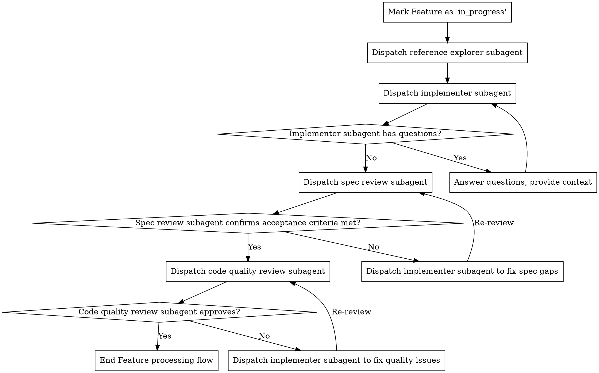

# Complete Feature Instruction

Complete a feature using following workflow.

## Instruction Workflow



**Your Feature processing flow tasks:**

1. Mark Feature as 'in_progress'
2. Dispatch reference explorer subagent
3. Dispatch implementer subagent
4. If the implementer subagent has questions, answer them, then re-dispatch the implementer subagent
5. Dispatch spec review subagent
6. If the spec review subagent does not pass acceptance, re-dispatch the implementer subagent to fix spec gaps
7. Dispatch code quality review subagent
8. If the code quality review subagent does not pass acceptance, re-dispatch the implementer subagent to fix code quality issues
9. End Feature processing flow

**RED LAW**: during feature processing workflow, it is forbidden to arbitrarily simplify the process. All 9 feature processing flow tasks listed above must be executed one by one accurately in order and completely.

Below are the detailed execution steps for the Feature processing flow tasks:

### Mark Feature as 'in_progress'

Execute the following command to mark the current Feature as 'in_progress':

```bash
furina change feature \<name\> --start \<feature-id\>
```

### Dispatch Reference Explorer Subagent

- Prerequisite: `experimental.explore = true`; otherwise, dispatching the reference explorer subagent is **not allowed — skip this exploration**
- Strictly follow the template: `${CLAUDE_PLUGIN_ROOT}/skills/furina-sdd/references/reference-explorer-prompt.md`, to dispatch the `reference explorer subagent`.

### Dispatch Implementer Subagent

Strictly follow the template: `${CLAUDE_PLUGIN_ROOT}/skills/furina-sdd/references/code-implementer-prompt.md`, to dispatch the `implementer subagent`.

### Dispatch Spec Review Subagent

- Prerequisite: `experimental.review.specs = true`; otherwise, dispatching the spec review subagent is **not allowed — skip this review**
- Strictly follow the template: `${CLAUDE_PLUGIN_ROOT}/skills/furina-sdd/references/specs-reviewer-prompt.md`, to dispatch the `spec review subagent`.

### Dispatch Code Quality Review Subagent

- Prerequisite: `experimental.review.code = true`; otherwise, dispatching the code quality review subagent is **not allowed — skip this review**
- Strictly follow the template: `${CLAUDE_PLUGIN_ROOT}/skills/furina-sdd/references/quality-reviewer-prompt.md`, to dispatch the `code quality review subagent`.

### End Feature Processing Flow

1. Execute the following command to mark the currently processed Feature as 'done':
   ```bash
    furina change feature \<name\> --complete \<feature-id\>
   ```
2. Add all unstaged changes involved in this feature <name> to the staging area, you can refer to the following commands:
   ```bash
   git add --all
   ```

### REA LAW

- For modifying Git commands, this instruction ONLY ALLOWs `git add` to be executed, and `git add` command MUST be execute in `End Feature Processing Flow`.
- `git commit` and `git push` is absolutely forbidden!
