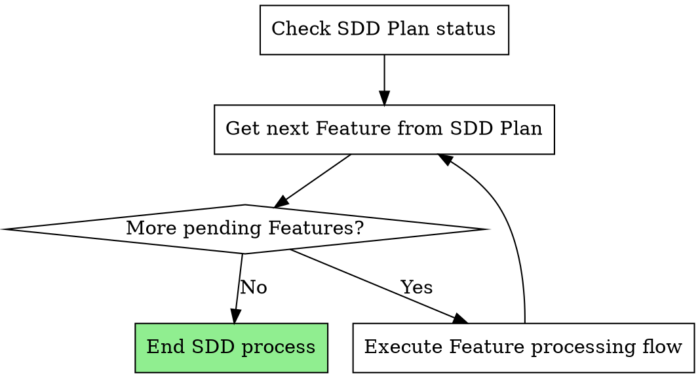

# Subagent-Driven Development

Execute a feature list by dispatching a fresh subagent for each Feature, with two-phase review after each feature: first specification compliance review, then code quality review.

**Core principle:** Fresh subagent per feature + two-phase review (spec first, then quality) = high quality, rapid iteration

**Dependency order:** Features in the Feature array are pre-sorted in topological order (dependencies first, dependents later). Process in array order. Skip any feature whose dependencies are not yet completed — return to it once its dependencies are resolved.

**Prerequisite:** Check if `openpowers/changes/<name>/plan.json` exists. If not, stop execution and remind the user to first execute the skill `openpowers-plan` to generate `plan.json`.

## Skill Configuration

Query the `skill configuration` required by the plugin via the following script:

```bash
openpowers config show language experimental.explore experimental.review.specs experimental.review.code
```

Returns three values in order:

1. `language` — Output language for all user-facing answers and output of this skill. If `None`, default to Chinese.
2. `experimental.explore` — Toggle for dispatching the reference explorer subagent. When this value is not `true`, dispatching the reference explorer subagent is **not allowed** (this is a user-enforced configuration).
3. `experimental.review.specs` — Toggle for dispatching the specification review subagent. When this value is not `true`, dispatching the specification review subagent is **not allowed** (this is a user-enforced configuration).
4. `experimental.review.code` — Toggle for dispatching the code quality review subagent. When this value is not `true`, dispatching the code quality review subagent is **not allowed** (this is a user-enforced configuration).

## SDD Process



**Your overall SDD process tasks:**

1. Check SDD Plan status
2. Get next Feature from SDD Plan — if none, invoke `openpowers-finalize` to end the SDD process
3. Execute Feature processing flow: strictly follow the steps in `### Execute Feature Processing Flow`
4. Repeat from step 2 until there are no more pending features, then invoke `openpowers-finalize` to end the SDD process

### Check SDD Plan Status

Execute the following command to check the current status of the SDD Plan:

```bash
openpowers change feature \<name\> --status
```

### Get Next Feature from SDD Plan

Execute the following command to get the next Feature to process from the SDD Plan:

```bash
openpowers change feature \<name\> --next
```

### Execute Feature Processing Flow

You **MUST** strictly and accurately execute `Complete Feature Instruction`: `${CLAUDE_PLUGIN_ROOT}/skills/openpowers-sdd/instructions/complete-feature.md`

## Feature Management

**Use `openpowers change feature \<name\>` commands instead of TodoWrite** for persistent, cross-session tracking.

**Why:** TodoWrite is session-scoped and loses state across sessions. The feature list JSON managed by `openpowers change feature \<name\>` is persistent and serves as the single source of truth.

## Strategy and Benefits

Read the reference document: `${CLAUDE_PLUGIN_ROOT}/skills/openpowers-sdd/references/important-matters.md` to learn about the strategy and benefits of the openpowers-sdd skill.

## Example Workflow

You must first reference the example workflow in `${CLAUDE_PLUGIN_ROOT}/skills/openpowers-sdd/references/example-workflow.md` before executing this skill.

## Allowed Documents to Read

**This skill openpowers-sdd is only allowed to read the following documents; reading any other documents within this skill is illegal:**

- `${CLAUDE_PLUGIN_ROOT}/skills/openpowers-sdd/instructions/complete-feature.md`
- `${CLAUDE_PLUGIN_ROOT}/skills/openpowers-sdd/references/example-workflow.md`
- `${CLAUDE_PLUGIN_ROOT}/skills/openpowers-sdd/references/important-matters.md`
- `${CLAUDE_PLUGIN_ROOT}/skills/openpowers-sdd/references/code-implementer-prompt.md`
- `${CLAUDE_PLUGIN_ROOT}/skills/openpowers-sdd/references/specs-reviewer-prompt.md`
- `${CLAUDE_PLUGIN_ROOT}/skills/openpowers-sdd/references/quality-reviewer-prompt.md`
- `${CLAUDE_PLUGIN_ROOT}/skills/openpowers-sdd/references/reference-explorer-prompt.md`

## Red Warnings

**Never:**

- Read project files beyond the templates and reference files cited by this skill (keep context clean; implementation work is done by subagents)
- Begin implementation on the main/master branch without first asking the user for consent; otherwise, terminate execution
- Skip enabled reviews (spec compliance or code quality) — when the config toggle is `true`, they must be executed
- Skip dispatching the reference explorer
- Continue with unresolved issues
- Dispatch multiple implementation subagents in parallel (would conflict)
- Let subagents read the feature list JSON file (should provide feature data directly)
- Skip setting scene context (subagents need to understand the feature's place in the whole)
- Ignore subagent questions (answer them before letting them proceed)
- Accept "close enough" on spec compliance (spec reviewer finding issues = not done)
- Skip review loop (reviewer finds issues = implementer fixes = review again)
- Let implementer self-review substitute for actual review (both are needed)
- **Start code quality review when spec compliance has not yet passed** (wrong order)
- Move to the next feature while any review still has pending issues
- Forget to update feature status in JSON after completing a feature
- **Dispatch any subagent as Backgrounded agent** (all subagents must run in foreground)

**If a subagent asks questions:**

- Answer clearly and completely
- Provide additional context if needed
- Do not rush them into the implementation phase

**If a reviewer finds issues:**

- Dispatch a new implementer subagent to fix them
- Reviewer reviews again
- Repeat until approved
- Do not skip re-review

**If a subagent feature fails:**

- Dispatch a fix subagent with specific instructions
- Do not attempt manual fixes (would pollute context)

## Integration Relationships

**Required workflow skills:**

- **openpowers-plan** — Creates the feature list JSON that this skill executes
- **openpowers-finalize** — Completes development after all features are done

**Subagents should use:**

- **openpowers-tdd** — Subagents follow TDD for each feature
